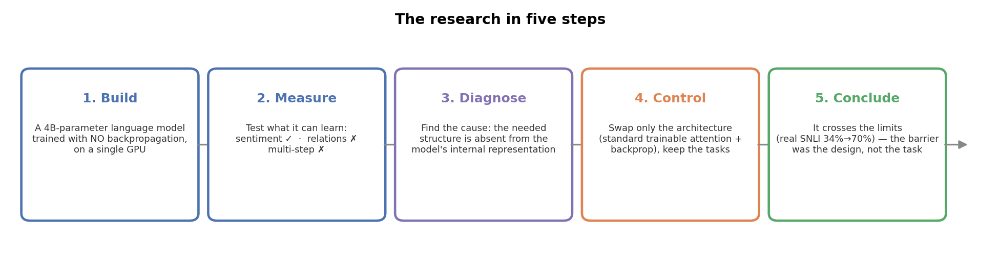
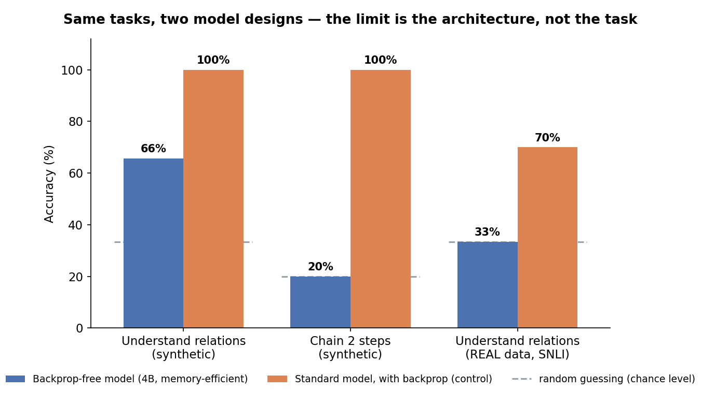
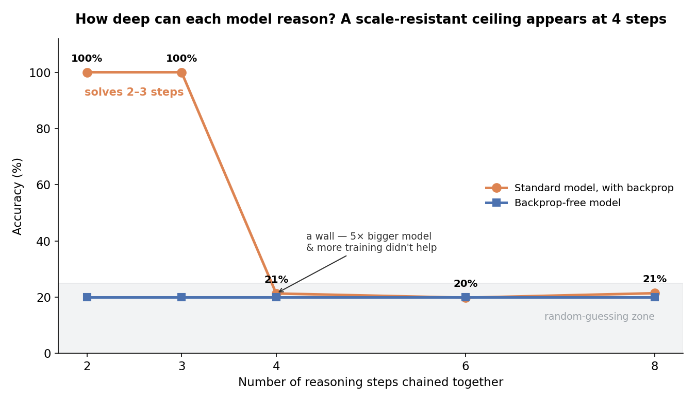
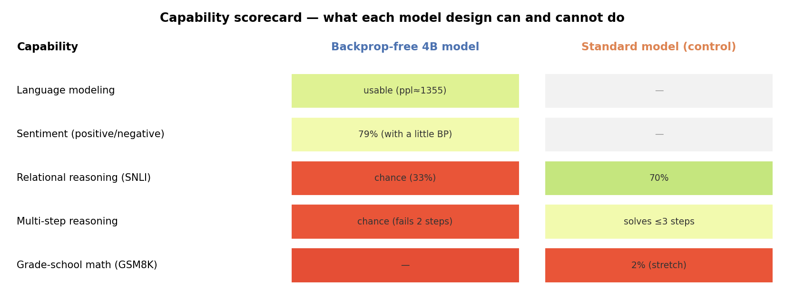

# Can a large AI model learn *without* backpropagation — and if it can't reason, is that the method or the design?

*A controlled study of a 4-billion-parameter language model trained with no backpropagation, and what its failures actually tell us.*

Modern AI language models are trained with an algorithm called **backpropagation**, which is powerful but memory-hungry — training a large model this way needs expensive hardware. This project asks a simple question with a surprising answer:

> **If we train a large model *without* backpropagation on a single ordinary GPU, what can it learn — and when it fails at reasoning, is that because of the training method, the model's design, or the task being genuinely hard?**

We built such a model (4 billion parameters, trained on one GPU with **zero backpropagation**), carefully measured where it succeeds and fails, diagnosed *why*, and then ran a clean control experiment that pins the blame precisely. The short version: **its failures on reasoning are caused by the model's architecture, not by avoiding backpropagation and not by the tasks being unlearnable.** A standard design solves the very same tasks — while revealing an honest limit of its own.

---

## Background in one minute

- **Language model:** software that predicts and understands text. Bigger models (more "parameters") are generally more capable but cost more to train.
- **Backpropagation:** the standard training algorithm. It works, but it must hold a lot of intermediate data in memory — which is why training big models normally needs lots of expensive GPUs.
- **Why avoid it?** A training method that skips backpropagation could train large models far more cheaply. The trade-off, and the research question here, is: *how much capability do you give up?*
- **The tasks we test** (chosen because they span what modern AIs are judged on):
  - **Sentiment** — is a sentence positive or negative? (easy, "surface-level")
  - **Relational reasoning (NLI)** — does sentence B logically follow from sentence A? (needs real comprehension)
  - **Multi-step reasoning** — chain several steps of arithmetic to one answer (needs sequential thinking)
  - **Grade-school math (GSM8K)** — real word-problems.

---

## What we built

A 4-billion-parameter language model that trains with **no backpropagation at all** — every update is a simple, hand-written local rule, and only **0.42% of the model is touched per step**. It fits on a single 16 GB GPU (~8 GB peak; training the same size *with* backpropagation would need ~31 GB and not fit). It reaches usable language quality (competitive perplexity on the standard WikiText-103 benchmark) and is fully deterministic and reproducible.

So the backprop-free model *works* as a language model. The interesting part is where it stops.

---

## What we found

### 1. A sharp capability boundary — easy tasks yes, reasoning no

With a little extra tuning the model does well on **sentiment (79%)**. But on **relational** and **multi-step** reasoning it stays stuck at **random-guessing level**, no matter how much we tuned it. That's the first clue that something structural — not just "needs more training" — is going on.

### 2. Why? The needed structure simply isn't there

We looked inside the model and asked *where* the relational information lives. The answer: **nowhere.** The information a reasoning task needs is **absent from the model's internal representation entirely** — so no amount of clever "reading out" of the model can recover it. The bottleneck is upstream, baked into the design.

### 3. The control experiment: swap only the architecture

To prove the boundary is caused by the *architecture* and not by avoiding backpropagation, we built a **standard model** (ordinary trainable attention + ordinary backpropagation) and gave it the **exact same tasks**. It solves them:

*The backprop-free model (blue) can't get relational or multi-step tasks above chance even with heavy tuning. The standard model (orange) solves the identical tasks — including reaching **70% on real-world SNLI**, where the backprop-free model is at random-guessing (33%).*

**Conclusion: the reasoning failures were a property of the design, not of the task or of skipping backpropagation.**

### 4. But the good design has an honest limit of its own

The standard model isn't magic. On **multi-step reasoning**, it handles 2–3 chained steps perfectly but hits a **wall at 4+ steps** — and, tellingly, making the model **5× bigger and training it 2.5× longer didn't move it at all**. So this is a genuine limit of "architecture + scale," not just under-training:

*Deep step-by-step reasoning needs more than a good backbone and more compute — likely step-by-step supervision or "show your work" (chain-of-thought) training, which we flag as future work.*

### The full picture

*What each design can and cannot do. Green = works, red = fails, grey = not measured for that design. Every number is a real measured result.*

---

## Things that surprised us (and that we corrected honestly)

A distinctive feature of this project: **several of our own hypotheses were proven wrong by later experiments, and we kept the corrections.** A few examples, in plain terms:

- We first thought a particular design detail ("collapsing the sentence to one point") was the bottleneck. It **wasn't** — the deeper cause was that the reasoning structure never formed at all.
- We thought making the good model **bigger** would break the 4-step reasoning wall. It **didn't**.
- One "result" turned out to be a **measurement artifact**: a broken scoring head was reporting a flat number that looked like a real (bad) result. A fair re-measurement revealed the truth. *Lesson: always measure capability with a fair, independent probe — twice here, an unfair one fabricated or hid the real number.*

This honesty log is part of what makes the study trustworthy; the full version is in the [technical report](PAPER_DRAFT.md).

---

## Bottom line

1. **A large model *can* be trained without backpropagation on modest hardware** and be useful for language and simple tasks — a real efficiency result.
2. **Its reasoning failures are architectural, not fundamental.** Avoiding backpropagation wasn't the problem; the model's frozen, information-discarding design was. A standard design crosses those limits.
3. **Even a good design has honest limits** (deep multi-step reasoning, real math), pointing to concrete next steps rather than hype.

The value isn't a record-breaking score — it's a **clean, controlled answer to "algorithm vs. architecture vs. task,"** a question that's usually impossible to separate.

---

## Dig deeper

| If you want… | Read |
|---|---|
| The full technical report (with methods, all results, appendices) | **[PAPER_DRAFT.md](PAPER_DRAFT.md)** (~9–11 pp) |
| A shorter conference-style version | [PAPER_workshop.md](PAPER_workshop.md) (8 pp) |
| A talk outline | [slides_outline.md](slides_outline.md) |
| The raw measured results (JSON) | [results/](results/) |
| The locked-conclusions index & full experiment log | [MASTER_ARCHIVE.md](MASTER_ARCHIVE.md) · [EXPERIMENT_LEDGER.md](EXPERIMENT_LEDGER.md) |
| Design decisions & rationale | [docs/adr/](docs/adr/) · [ARCHITECTURE.md](ARCHITECTURE.md) |
| The figures above (regenerate) | `python3 make_figures.py` → [figures/](figures/) |

**Code map:** `kaggle_zerograd_moe.py` — the backprop-free 4B model · `phase_h/` — the standard-model control (isolated) · `phase_e*.py`, `v2_*.py`, `task_*.py` — the boundary experiments · `track1_sst2_4b.py` — the real-data sentiment probe. Reproduce locally (no GPU): `python3 phase_h/ph_nli.py` (control model solving synthetic reasoning) or `python3 kaggle_zerograd_moe.py` (backprop-free model, deterministic).

*Deployment / competition-submission details are separate from this research write-up; see [SUBMISSION.md](SUBMISSION.md).*
